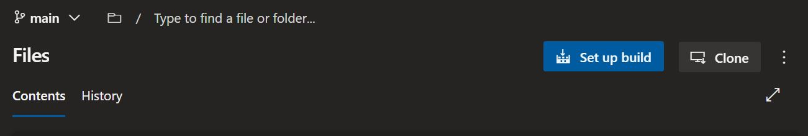
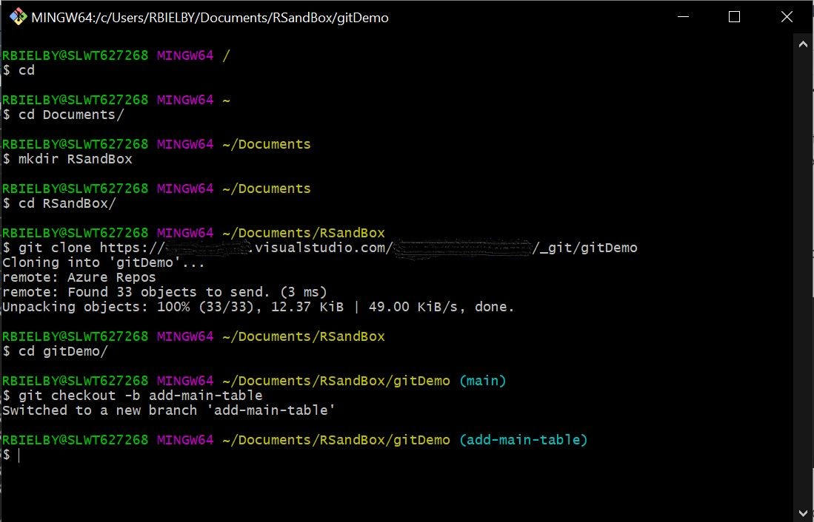

# Introduction
TODO: Give a short introduction of your project. Let this section explain the objectives or the motivation behind this project.

# Creating a new repository

Let's start by going to Dev Ops and creating our remote repository. This is where everything is going to be stored reliably and version control can be managed. So go to a Project you have access to, click **Repos** and then the **+** symbol near the top of the sidebar. From there you can click **New repository**. Give it a name (Repository Type field should default to git, but just make sure) and click **Create**.

Now have a remote Repo that you can work with.

# Cloning and initial set up

## Opening the repository in R-Studio as a new R-Project

Let's start with creating a local copy (i.e. cloning) using R-Studio. Open a new instance of R-Studio and select **File>New Project...** Then select the **Version control** (Checkout a project from a version control repository). On the new page, select **Git** (Clone a project from a Git repository). Now we need the Repo URL. So go to the Repo page on Dev Ops and click **Clone** near the top right of the page. This should show a HTML address for the repository. Copy this URL into the **Repository URL:** box in RStudio **New Project Wizard** dialogue box and enter the folder where you want to clone the repo (note that the package name gets filled in automatically once you've entered its URL).

## Aside on *renv*: Initialising and why to use it

The next step isn't necessarily essential or intrinsic to Git repositories, but it's good practice so I'm going to do it. This involves using the **renv** *R* package for *environmental control*. So using R scripts across different systems can cause issues in terms of inconsistencies in terms of both package version and overall *R* version. So for example, the standard R version from *Software Centre* at time of writing is **4.1.2**, whereas the version being used on *rsconnect* is **4.0.2**. So we can use **renv** to make sure that any realisations of the repo use the same version of *R* and the associated packages.

So in the console, let's run the following:

```
install.packages("renv")
renv::init()
renv::install(shiny)
renv::snapshot()
```

The first two install and initialise **renv**, the third installs the shiny package and the fourth line sets the "snapshot", which effectively locks in the versions of the packages that you're using so that anyone cloning the repository (or any sever running the scripts) will be directed to install those pacakges as the versions that you're using.

## Making a small example Shiny App

Now let's make a quick Shiny App as a toy to help us get to know *git* a little bit.

A Shiny App requires the user interface code and the server code. I like having these in standalone files: **ui.R** and **server.R**.

Here's the code for ui.R:

```
library(shiny)
ui <- fluidPage(
  titlePanel("Toy Shiny App"),
  sidebarLayout(
    sidebarPanel(),
    mainPanel()
  )
)
```

And the code for server.R:

```
server <- function(input,output){}
```

Now click **Run App** and the App should run, although it's not really got any content to show.

## Initial Commit (using the R-Studio GUI)

So we've done some set-up and have a 'working' App, let's sync (or commit) that to Dev Ops. So go to **Tools>Version control>Commit...**. A dialogue box will come up with a few different panes with some associated actions. The top left pane shows any files that have changed since the last *commit*.

We want to sync these with the remote repo so we've got our initialisation steps recorded there. To do so, select the files that have changed and then click the **Stage** button above them - this marks them as files that you want adding to the commit. Now enter a *commit* message in the top right pane describing the changes that have been made. Once you're happy with the message, click **commit**. This creates a log of updates that are being made that are ready to be *pushed* to the remote repository. To do the final sync to the remote repoistory, click the green arrow or **Push** button at the very top right of the **Review Changes** pane. This syncs (i.e. *pushes*) all changes to the remote repository. Conversely, next to **Push** is **Pull**, which can be used to sync any changes on the remote server to the current local copy that you're using.

# Branches and Managing git in the Bash Terminal

So we've got a working App that we'd like to develop, but we don't want to risk damaging the working version (we might need to use it in anger, whilst we're developing new bits to it). So the way we can protect the existing working version, whilst also developing it is to create a branch.

## Creating a new branch

First lets create a new branch in the remote repository. You can do it locally, but personally I find the remote repository the more efficient and simpler way to do it.



The little symbol next to **main** in the above is the branch symbol. Click on this (or main) and you'll get a drop down menu that gives you the option to create a new branch. Create a new branch and give it a name (e.g. add-main-table).

That's the new branch made.

## Working in bash

We can checkout a branch using the R-Studio GUI (using the menu bar in the *Review Changes* dialogue box), but let's give the bash terminal a go instead. Suppose we're now a team mate who wants to make the updates to the original App. We'll start by creating a new clone of the repository somewhere locally. Open up the bash terminal and navigate to a directory that you're happy having the repo sit in (the commands cd and mkdir - change directory and make directory are useful here). Then run:

```
git clone https://server.visualstudio.com/project/_git/repoName
```

That's created a second copy of the repo on our local machine. Next we want to switch away from the main branch and into the *add-main-table* branch. To do this, *cd* into the repo directory and checkout the new branch:

```
cd gitDemo
git checkout add-main-table
```

This should give you some output that looks like the following:



If you've got something like the above, your working copy in this folder will push to and pull from the *add-main-table* branch. So now let's open this up in R-Studio and have a go at making an update on this branch and then, once we're happy it works as intended, merging this back into the main branch for our users or team-mates to be able to use.

## Editing the code in the new branch

So let's add a table quickly to the Shiny App. We can add the following to **ui.R**:

`tableOutput("presents")`

And the following inside **server.R**:

```
output$presents <- renderTable(
  data.frame(
    names=c("Richard","John","George","Paul"),
    presents=c("Hat","Pokemon","Hulk","Book")
  )
)
```

And try re-running the Shiny App. If it works, we're happy and we can commit it to the branch. To do this we need to `add` (equivalent of Staging in the R-Studio GUI), `commit` and `push` in the bash terminal as follows:

```
git add *
git commit -m "Added the present table to the mainPanel() in the App and it works!"
git push
```

If you now go and look at the repo on Dev Ops and navigate to the *add-new-table* branch (using the drop down menu you used to create the branch in the first place), you should see these updates are synced to the branch. If you look on the main branch, you should see the basic pre-table App still there.

## Pull Requests and merging back into the main branch

Supposing that's all we wanted to do, we've tested the new feature and we feel ready to bring it into the main branch. We can do this by creating a **pull request** and **merging** the branch back in. Probably the simplest way to do this is within Dev Ops, so lets stay there and give it a go.

First, within the repo on Dev Ops, make sure you're on the page displaying the add-new-table branch and you should see a button saying **Create a pull request**.  You'll be taken to a screen where you can give the pull request a title and a description so that anyone looking back through the logs can see what's gone on. You can also add Reviewers here allowing colleagues to review and comment on code changes. Once you're happy with those, click **Create** and you'll be taken to a screen listing any conflicts - i.e. any changes in the add-new-table branch that conflict with any changes that have been made to the main branch since the add-new-table branch was created. In this simple case, you should get a message saying *no merge conflicts*.

One of the neat features now is that we can review the changes and offer comments. Click on the *Files* tab and you'll see a comments panel and a file changes panel. You or a reviewer can make comments both in the comments panel, or by clicking on a line of code in the file changes panel. This is great for being able collaborate and discuss changes to code.

Once we're happy that the branch is what we want it to be, all that's left to do is to click 'Complete' in the *Overview* tab (after clicking *Approve* if you've added yourself as a Reviewer) and the add-new-table branch will be merged back into the main branch. The add-new-table branch will also be removed from the active branches list.
